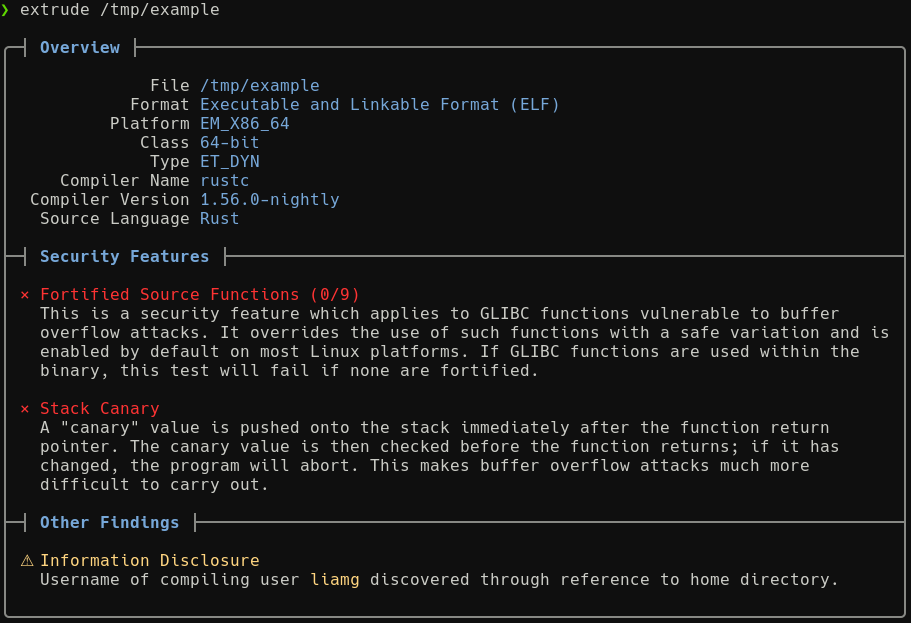

# extrude

Scan binaries for missing security features, information disclosure and more.

:construction: Extrude is in the early stages of development, and currently only supports ELF binaries.



## Usage

```
Usage:
  extrude [flags] [file]

Flags:
  -a, --all               Show details of all tests, not just those which failed.
  -w, --fail-on-warning   Exit with a non-zero status even if only warnings are discovered.
  -h, --help              help for extrude

```

## TODO

- Add support for Mach-o
- Add support for PE
- Add secret scanning
- Detect packers

